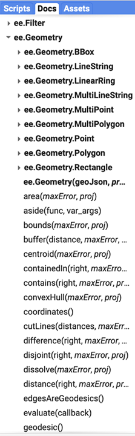

# Geometry

Google Earth Engine handles vector data with the Geometry type. Traditionally, this means 

* Point
* Line
* Polygon

However, GEE has several different nuances. 

* `Point`
* `LineString`
  * List of Points that do not start and end at the same location
* `LinearRing`
  * LineString which does start and end at the same location
* `Polygon`
  * List of LinearRing's - first item of the list is the outer shell and other components of the list are interior shells

GEE also recognizes MultiPoint, MultiLineString and MultiPolygon, which is simply a collection of more than one element. Additionally, you can combine any of these together to form a `MultiGeometry`. Here is a quick [video](https://www.youtube.com/watch?v=OdBhndxgN48) of working with the Geometry tools within GEE. 

Once you have a set of geometries, there are geospatial operations you can use for analysis, such as building buffer zones, area analysis, rasterization, etc. The [documentation](https://developers.google.com/earth-engine/guides/geometric_operations) contains some basic examples to show you how to get started, although there are many more functions listed under the 'Docs' tab in the Code Editor.

 

## 